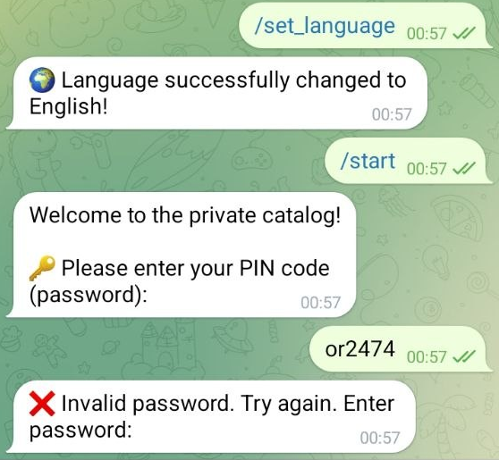
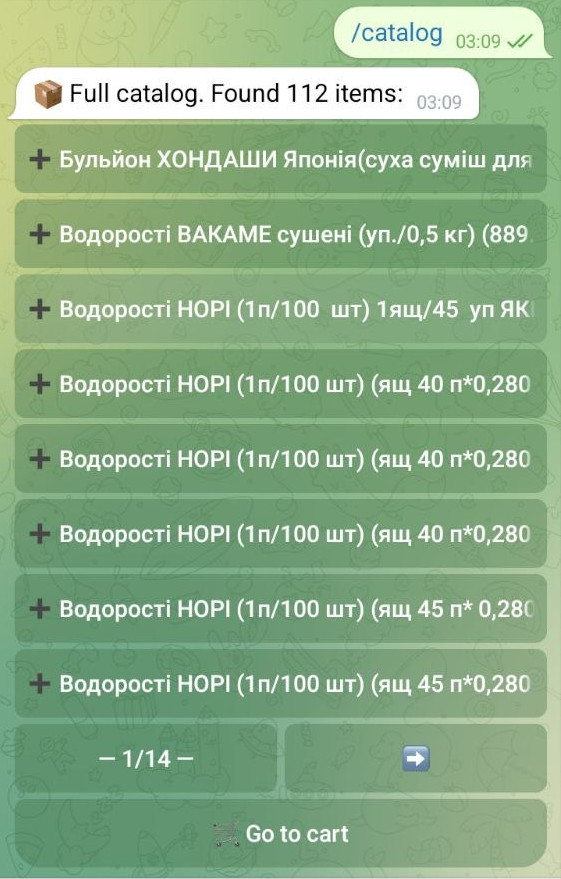
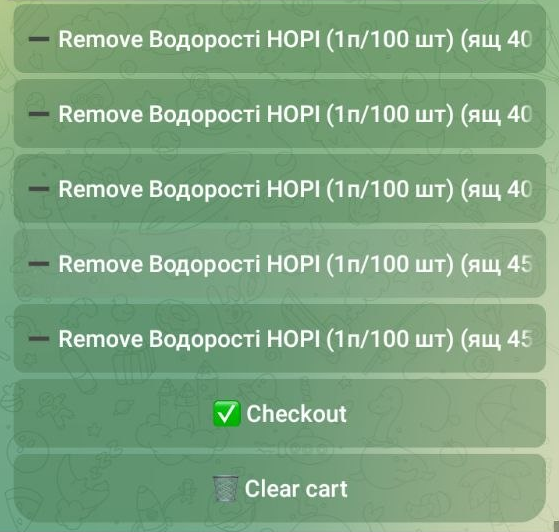
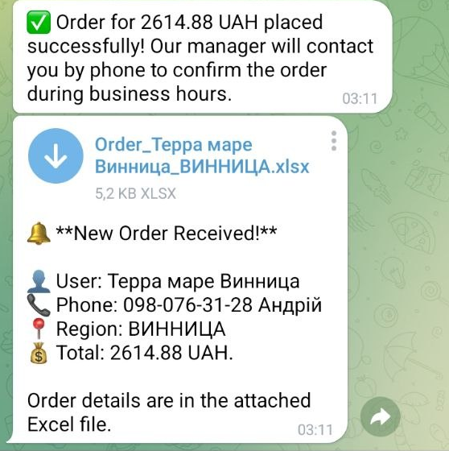
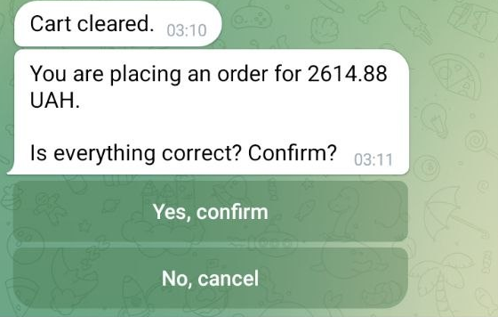
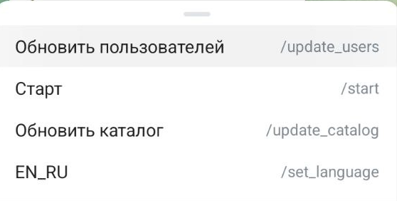

🌍 *[Read this in English](#english-version) | [Читать на русском](#russkaya-versiya)*

---

# English Version <a name="english-version"></a>

# 🤖 B2B Order Telegram Bot

A private corporate Telegram bot for wholesale and regular B2B clients. 
Allows users to authorize via PIN code, browse a multilingual catalog, add items to a cart, and place orders. All submitted orders are automatically exported as formatted Excel documents and can be delivered instantly to the Manager via Telegram or Email.

## 🌟 Features
- **Private Access:** PIN-code authorization (case-insensitive).
- **Multilingual:** Auto-detects UI language (EN/RU) or force-switches via `/set_language`.
- **Product Catalog:** Paginated item cards (8 per page).
- **Smart Search:** Full-text case-insensitive search support. Matches any part of the product name.
- **Shopping Cart:** Real-time total calculation and quantity editing.
- **Flexible Order Delivery:** Orders can be pushed directly to configured Telegram admin accounts and/or sent via Email (SMTP) based on the business owner's preference. Excel files are automatically generated.
- **Instant Callback Info:** Both Telegram and Email notifications prominently feature the client's contact phone number, allowing the manager to instantly call back and confirm the order.

## 📸 App Screenshots

<table>
  <tr>
    <td align="center"><b>Login & Auth</b></td>
    <td align="center"><b>Product Catalog</b></td>
    <td align="center"><b>Shopping Cart</b></td>
  </tr>
  <tr>
    <td></td>
    <td></td>
    <td></td>
  </tr>
  <tr>
    <td align="center"><b>Checkout Order</b></td>
    <td align="center"><b>Confirmation</b></td>
    <td align="center"><b>Manager Commands</b></td>
  </tr>
  <tr>
    <td></td>
    <td></td>
    <td></td>
  </tr>
</table>

---

## 🛠 Setup & Launch

### 1. Environment Variables
Create a `.env` file in the root directory with the following settings:

```env
BOT_TOKEN=your_telegram_bot_token
ADMIN_IDS=your_telegram_id
MANAGER_EMAIL=manager_email@gmail.com
SMTP_SERVER=smtp.gmail.com
SMTP_PORT=465
SMTP_USER=sender_email@gmail.com
SMTP_PASS=your_app_password
```
*(For Gmail, `SMTP_PASS` is a 16-character "App Password" generated in Google security settings).*

### 2. Run
```bash
python -m venv .venv
# Activate the virtual environment (depends on OS)
pip install -r requirements.txt
python bot.py
```

---

## 📋 Database Formats (Excel)
Catalog and client list management is done by sending Excel documents to the bot. Headers (the first row) are **strictly required** and must be in English.

### Command `/update_users` (Add clients)
The `.xlsx` file must contain these columns:
* `name` — Name / Company.
* `pin` — Client's password to login.
* `phone` — Phone number (crucial for manager emails).
* `region` — City or discount group label.

### Command `/update_catalog` (Update catalog)
The `.xlsx` file must contain these columns:
* `name` — Full product name.
* `price` — Price (numeric).

<br><br>

---

# Русская версия <a name="russkaya-versiya"></a>

# 🤖 Telegram-бот для приема B2B заказов

Закрытый корпоративный Telegram-бот для оптовых и постоянных клиентов. 
Позволяет пользователям авторизоваться по PIN-коду, просматривать мультиязычный каталог, собирать товары в корзину и отправлять заказы. Все сформированные заказы генерируются в виде аккуратного Excel-документа и моментально доставляются администраторам в Telegram и/или менеджеру на Email.

## 🌟 Возможности
- **Закрытый доступ:** Авторизация по PIN-коду (без учета регистра).
- **Мультиязычность:** Автоматическое определение языка (EN/RU) или принудительная смена кнопкой `/set_language`.
- **Каталог товаров:** Пагинация карточек по 8 штук на страницу.
- **Умный поиск:** Поддержка полнотекстового поиска на кириллице без учета регистра. Совпадения ищутся по любому куску названия.
- **Корзина заказов:** Подсчет суммы в реальном времени и редактирование количества.
- **Гибкая доставка заказов:** По выбору владельца бизнеса, оформленные заказы (с Excel-файлом) могут приходить напрямую администраторам в Telegram, либо отправляться классическим Email-письмом.
- **Мгновенная связь:** И в Telegram-уведомлении, и в Email-письме крупно выводится контактный номер клиента. Это позволяет менеджеру оперативно перезвонить и подтвердить заказ в 1 клик.

## 📸 Галерея интерфейса

<table>
  <tr>
    <td align="center"><b>Авторизация</b></td>
    <td align="center"><b>Каталог товаров</b></td>
    <td align="center"><b>Корзина</b></td>
  </tr>
  <tr>
    <td></td>
    <td></td>
    <td></td>
  </tr>
  <tr>
    <td align="center"><b>Оформление заказа</b></td>
    <td align="center"><b>Подтверждение</b></td>
    <td align="center"><b>Команды менеджера</b></td>
  </tr>
  <tr>
    <td></td>
    <td></td>
    <td></td>
  </tr>
</table>

---

## 🛠 Настройка и запуск

### 1. Переменные окружения
Создайте в корне проекта файл `.env` со следующими настройками:

```env
BOT_TOKEN=ваш_токен_бота_telegram
ADMIN_IDS=ваш_telegram_id
MANAGER_EMAIL=почта_менеджера@gmail.com
SMTP_SERVER=smtp.gmail.com
SMTP_PORT=465
SMTP_USER=почта_отправителя@gmail.com
SMTP_PASS=ваш_app_password
```
*(Для Gmail `SMTP_PASS` — это специальный "Пароль приложения", генерируемый в настройках безопасности Google).*

### 2. Запуск
```bash
python -m venv .venv
# Активация виртуального окружения (зависит от ОС)
pip install -r requirements.txt
python bot.py
```

---

## 📋 Форматы баз данных (Excel)

Управление каталогом и списком клиентов происходит через отправку Excel-документов боту. Заголовки (первая строчка) **строго обязательны** и должны быть на английском языке.

### Команда `/update_users` (Добавление клиентов)
В загружаемом `.xlsx` файле должны быть колонки:
* `name` — Имя / ФИО / Организация.
* `pin` — Пароль клиента для входа.
* `phone` — Номер телефона (крайне важен для писем менеджеру).
* `region` — Город или метка скидочной группы.

### Команда `/update_catalog` (Обновление каталога)
В загружаемом `.xlsx` файле должны быть колонки:
* `name` — Полное название товара.
* `price` — Цена (число).
